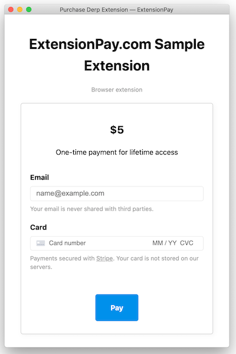

# ExtPay
The JavaScript library for [ExtensionPay.com](https://extensionpay.com), a service to add payments to browser extensions.

Below are the directions for using this library. If you learn better by example, you can also view the **[sample extension](sample-extension/)**.

### 1. Install
```bash
npm install extpay --save
```

or copy the [build/ExtPay.js](build/ExtPay.js) file into your project

### 2. Add extension permissions to your `manifest.json`
ExtPay needs the following permissions in your `manifest.json`:
```json
{
    manifest_version: 2,
    // ...
    permissions: [
        "https://extensionpay.com/*",
        "storage"
    ]
}
```
Right now the library doesn't support adding these as optional permissions but may in the future.


### 3. Add ExtPay to background.js

You need to put a call to ExtPay in a background file, often named something like `background.js`.

```js
// background.js
const extpay = ExtPay('sample-extension')
```

Using a bundler? You can also `import` or `require` your

First you'll need an extension id (like `'sample-extension'` in the example below). To get an extension id, sign up and register an extension at [extensionpay.com](https://extensionpay.com/signup)
```js
const extpay = ExtPay('sample-extension')
```


### 4. Use `extpay.getUser()` to check user's paid status

This method makes a network call to get the extension user's paid status and returns a `user` object.
```js
extpay.getUser().then(user => {
    // if (user.paid) ...
}).catch(err => {
    // do something if there's an error, probably from the network call
})    
```
or use `await`:
```js
async function foo() {
    const user = await extpay.getUser();
    // if (user.paid) {
}
```
The `user` object has the following properties:

* `user.paid` - boolean `true` or `false`.
* `user.paidAt` - JS `Date()` object that the user paid.
* `user.installedAt` - JS `Date()` object the user installed the extension.


### 5. `extpay.openPaymentPage()`
Opens a browser popup where the user can pay for the extension. You can bind this to a button.
```js
extpay.openPaymentPage()
```
It looks like this:



While testing, use your ExtensionPay email to test payments without entering credit card information. Reinstall the extension to reset back to an unpaid user.
