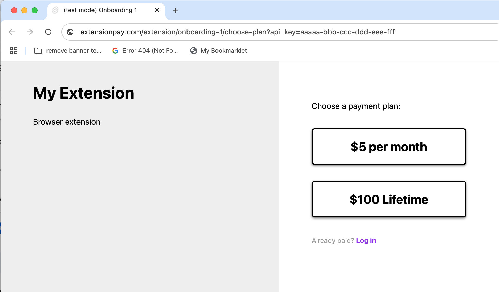
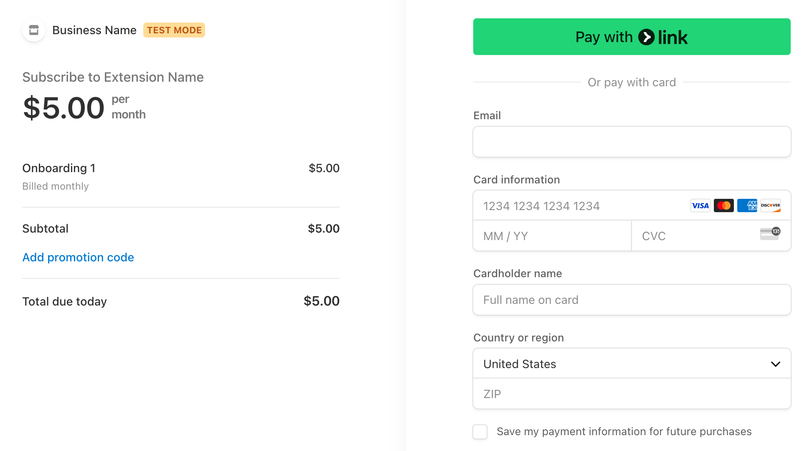
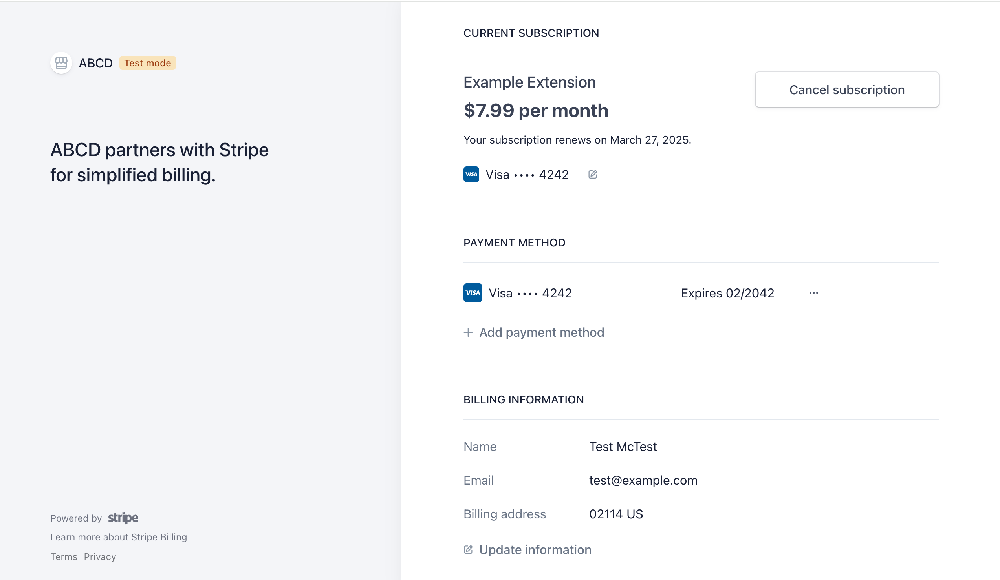

# ExtPay.js — Payments in browser extensions
The JavaScript library for [ExtensionPay.com](https://extensionpay.com), a service to easily add payments to browser extensions. So far ExtensionPay has earned extension creators over **$500k and counting**!

```js
// Example code
// your-extension/background.js
const extpay = ExtPay('your-extension-id');
extpay.startBackground();

extpay.getUser().then(user => {
    if (user.paid) {
        // ...
    } else {
        extpay.openPaymentPage()
    }
})
```

Below are directions for using this library in your browser extension. If you learn better by example, you can also view the code for a **[sample extension](sample-extension-mv3/)**. This library uses [Mozilla's webextension-polyfill library](https://github.com/mozilla/webextension-polyfill) internally for compatability across browsers which means it should work on almost all modern browsers.

> "It hasn't even been 1 year yet and I'm already going to **pass $4,000 in annual subscriptions on an extension that I never in a million years thought I would be able to make a penny from**. Thanks so much for creating this tool! I would not have even tried to monetize if I had to use Stripe directly, and you made it so easy. **It took less than an hour to set it up and test it**. Definitely have plans to create more extensions now that I know how easy it is to monetize them." - David, Neobuyer extension

  1. [Install](#1-install)
  2. [Configure your `manifest.json`](#2-configure-your-manifestjson)
  3. [Add `ExtPay` to `background.js` (required!)](#3-add-extpay-to-backgroundjs-required)
  4. [Use `extpay.getUser()` to check a user's paid status](#4-use-extpaygetuser-to-check-a-users-paid-status)
      * [`user` object properties](#user-object-properties)
  5. [Use `extpay.openPaymentPage()` to let the user pay](#5-use-extpayopenpaymentpage-to-let-the-user-pay)
  6. [Use `extpay.getPlans()` to list available payment plans](#6-use-extpaygetplans-to-list-available-payment-plans)
  7. [Use `extpay.onPaid.addListener()` to run code when the user pays](#7-use-extpayonpaidaddlistener-to-run-code-when-the-user-pays)
  8. [Use `extpay.openPaymentPage()` to let the user manage their subscription](#8-use-extpayopenpaymentpage-to-let-the-user-manage-their-subscription)
  9. [Use `extpay.openTrialPage()` to let the user sign up for a free trial](#9-use-extpayopentrialpage-to-let-the-user-sign-up-for-a-free-trial)
  10. [Use `extpay.openLoginPage()` to let the user log in if they've paid already](#10-use-extpayopenloginpage-to-let-the-user-log-in-if-theyve-paid-already)

**Note**: ExtPay.js doesn't contain malware or track your users in any way. This library only communicates with ExtensionPay.com servers to manage users' paid status.

If you like this library, please star it! ⭐️ It helps us out :)

## 1. Install

```bash
npm install extpay --save
```

If you're not using a bundler, you can copy the [dist/ExtPay.js](dist/ExtPay.js) file into your project (or [ExtPay.module.js](dist/ExtPay.module.js) for ESM / [ExtPay.common.js](dist/ExtPay.common.js) for Common JS). 


## 2. Configure your `manifest.json`
ExtPay needs the following configuration in your `manifest.json` (for both manifest v2 and v3):

```json
{
    "permissions": [
      "storage"
    ]
}
```

ExtPay will not show a scary permission warning when users try to install your extension.

If you have a `"content_security_policy"` in your manifest or get a `Refused to connect to 'https://extensionpay.com...'` error, you'll have to add `connect-src https://extensionpay.com` to your extension's content security policy. <a href="https://developer.mozilla.org/en-US/docs/Mozilla/Add-ons/WebExtensions/manifest.json/content_security_policy">See Mozilla's documentation for more details</a>.


## 3. Add `ExtPay` to `background.js` (required!)

You need to put `ExtPay` in your background file, often named something like `background.js`. If you don't include `ExtPay` in your background file it won't work correctly. If you're using a bundler you can `import 'ExtPay'` or `require('ExtPay')` right in your `background.js`.

With either Manifest V3 or Manifest V2 you'll need to **[sign up and register an extension](https://extensionpay.com)**. When you register an extension you'll create an extension id that you'll use when initializing `ExtPay`. We'll use `sample-extension` as the extension id in the following examples.

### Manifest V3

```json
{
    "background": {
        "service_worker": "background.js"
    }
}
```

```js
// background.js

importScripts('ExtPay.js') // or `import` / `require` if using a bundler

var extpay = ExtPay('sample-extension'); // Careful! See note below
extpay.startBackground(); 
```

**Note about service workers**: In the example above `extpay` will become undefined when accessed in service worker callbacks. To use `extpay` in service worker callbacks, redeclare it like so:

```js
chrome.storage.local.get('foo', function() {
    var extpay = ExtPay('sample-extension');
    // ...
})
```
Make sure not to use `extpay.startBackground()` in callbacks — it should only be called once.

### Manifest V2

If you're not using a bundler, add `ExtPay.js` to `manifest.json`:
```json
{
    "background": {
        "scripts": ["ExtPay.js", "background.js"]
    }
}
```


```js
// background.js
const extpay = ExtPay('sample-extension')
extpay.startBackground();
```


## 4. Use `extpay.getUser()` to check a user's paid status

This method makes a network call to get the extension user's paid status and returns a `user` object.
```js
extpay.getUser().then(user => {
    if (user.paid) {
        // ...
    } else {
        // ...
    }
})
```
or use `await`:
```js
async function foo() {
    const user = await extpay.getUser();
    if (user.paid) {
        // ...
    }
}
```
It is possible for `extpay.getUser()` to throw an error in case of a network failure. Please consider this possibility in your code e.g. `extpay.getUser().then(/* ... */).catch(/* handle error */)`

The `user` object returned from `extpay.getUser()` has the following properties:

### `user` object properties
| property | description |
| --- | --- |
| `user.paid` | `true` or `false`. `user.paid` is meant to be a simple way to tell if the user should have paid features activated. For subscription payments, `paid` is only true if `subscriptionStatus` is `active`. |
| `user.paidAt` | `Date()` object that the user first paid or `null`.|
| `user.email` | The user's email if there is one or `null`.|
| `user.installedAt` | `Date()` object the user installed the extension. |
| `user.trialStartedAt` | `null` or `Date()` object the user confirmed their free trial. |
| `user.plan` | `null` or the `plan` the user is on.  For example: `{unitAmountCents: 1000, currency: 'usd', nickname: null, intervalCount: 1, interval: 'month'}`. Unpaid users never have a plan. See `extpay.getPlans()` elsewhere in this README for more detail. |
| **subscription only**| |
| `user.subscriptionStatus` | One of `active`, `past_due`, or `canceled`. `active` means the user's subscription is paid-for. `past_due` means the user's most recent subscription payment has failed (expired card, insufficient funds, etc). `canceled` means that the user has canceled their subscription and the end of their last paid period has passed. [You can read more about how subscriptions work here](/docs/how_subscriptions_work.md). |
| `user.subscriptionCancelAt` | `null` or `Date()` object that the user's subscription is set to cancel or did cancel at. |

## 5. Use `extpay.openPaymentPage()` to let the user pay

Opens a new browser tab where the user can pay to upgrade their status.
```js
extpay.openPaymentPage([planNickname])
```
The payment page looks like this:



The plan buttons take you to a Stripe Checkout page:



Note: `extpay.openPaymentPage()` can fail to open the tab if there is a network error. Please consider this possibility in your code.

You can optionally include your `planNickname` as an argument to `extpay.openPaymentPage(planNickname)` to directly open the Stripe payment page for that plan. For example: `extpay.openPaymentPage('my_plan_nickname')`. Plan nicknames can be edited in the ExtensionPay.com extension settings page. 

While developing your extension in test mode, you will need to enter your account password in order to proceed to the Stripe Checkout page. Once there, you can use [Stripe's test cards](https://docs.stripe.com/testing) in order to test the payment experience.

It is best to open the payment page when the user has a clear idea of what they're paying for.

Depending on how you configure your extension, users that have paid before can log in to activate their paid features on different browsers, profiles, or after uninstalling/reinstalling.

You should turn on as many [payment methods in your Stripe settings](https://dashboard.stripe.com/settings/payment_methods) as possible to maximize your revenue.

Also see [our guide for how to create coupon / discount codes for your extensions](/docs/discount_code_guide.md).

## 6. Use `extpay.getPlans()` to list available payment plans

For example, an extension with a $10 monthly and $99 yearly plan might look like this:

```typescript
  > await extpay.getPlans();
  [
    {
      unitAmountCents: 1000,
      currency: 'usd',
      nickname: null,
      intervalCount: 'month',
      interval: 1
    },
    {
      unitAmountCents: 9900,
      currency: 'usd',
      nickname: null,
      intervalCount: 'year',
      interval: 1
    }
  ]
```

The specification for plans looks like this:
```typescript
  interface Plan {
    unitAmountCents: number;
    currency: string;
    nickname: string | null;
    interval: 'month' | 'year' | 'once';
    intervalCount: number | null;
  }
```
| property | description |
| --- | --- |
| `plan.unitAmountCents` | The amount in cents that the user pays in one interval. |
| `plan.currency` | The ISO 4217 currency the unit amount is in. For example: `'usd'` |
| `plan.nickname` | An optional plan nickname for the developer to use in identifying plans. Can be editing in extension settings. |
| `plan.interval` | The recurring interval the plan is charged. One of `'month'`, `'year'`, or `'once'`. |
| `plan.intervalCount` | `null` if `interval` is `'once'`, otherwise the number of intervals the plan is charged. For example: an `intervalCount` of `2` with an `interval` of `'month'` would mean the plan charges every 2 months. |

## 7. Use `extpay.onPaid.addListener()` to run code when the user pays

If you want to run some code when your user pays, use `extpay.onPaid.addListener()`:

```js
extpay.onPaid.addListener(user => {
    console.log('user paid!')
})
```

To use this feature, you will need to include the following content script configuration in your `manifest.json`:

```json
{
    "content_scripts": [
        {
            "matches": ["https://extensionpay.com/*"],
            "js": ["ExtPay.js"],
            "run_at": "document_start"
        }
    ]
}
```

The content script is required to enable `extpay.onPaid` callbacks. It will add a permissions warning when installing your extension. If you're using a bundler, you can create a file called something like `ExtPay_content_script.js` that only contains `import 'ExtPay'` or `require('ExtPay')` and use that in the `"js"` field above.

You can add as many callback functions as you want.

Note: `onPaid` callbacks will be called after a user pays as well as after a user "logs in" (e.g. activates their paid account on a different browser/profile/install). This may change in the future -- if you'd like this to work differently, please contact me with a detailed explanation of your use case :)


## 8. Use `extpay.openPaymentPage()` to let the user manage their subscription

If your extension is configured for subscription payments, you should let the user manage/cancel their subscription from within the extension with the same function you used to let them pay:

```js
extpay.openPaymentPage()
```

The subscription management page looks something like this:

 

Obviously you should allow your users to access this page in order to cancel their subscription!

Note: please read the **[detailed docs on subscriptions here](/docs/how_subscriptions_work.md)**.


## 9. Use `extpay.openTrialPage()` to let the user sign up for a free trial

If you want to give your users a trial period of your extension, you can use `extpay.openTrialPage()`, which looks something like this:

 

The user will be sent an email with a link that they can use to start their free trial. Once the user clicks the link, you can use the `trialStartedAt` property from `extpay.getUser()` in your extension to check if the trial has expired.

For example, if you wanted a 7 day trial period, you could use a check like this:

```js
const extpay = ExtPay('sample-extension');
extpay.getUser().then(user => {
    const now = new Date();
    const sevenDays = 1000*60*60*24*7 // in milliseconds
    if (user.trialStartedAt && (now - user.trialStartedAt) < sevenDays) {
        // user's trial is active
    } else {
        // user's trial is not active
    }
})

After users start a trial, the user object will have the `trialStartedAt` property populated. If users uninstall and reinstall your extension and then attempt to start a new trial using the same email they previously used, they will be instantly "logged in" to their existing free trial without needing to confirm instead of starting a new trial or being rejected. Their `trialStartedAt` will be the same. If this is confusing, please try it out in development!

```

Note that `extpay.openTrialPage(displayText)` takes an optional string argument that is displayed to the user on the trial page. For example, `extpay.openTrialPage('7-day')` would change the trial prompt from `Enter an email to start your free trial` to `Enter an email to start your *7-day* free trial`. This is meant to give your users a better idea of what they're signing up for.

You can also use `extpay.onTrialStarted.addListener()` to run functions when the user's trial starts. Like `onPaid`, you need to include the following in your `manifest.json` to make it work:

```json
{
    "content_scripts": [
        {
            "matches": ["https://extensionpay.com/*"],
            "js": ["ExtPay.js"],
            "run_at": "document_start"
        }
    ]
}
```

## 10. Use `extpay.openLoginPage()` to let the user log in if they've paid already

A page will open that will allow the user to enter the email they paid with to receive a magic login link. This page can also be accessed through the normal payment screen.

## Contributing

1. `npm install`
2. Edit `ExtPay.dev.js`
3. `npm run dev`
4. `npm run dist` before committing changes.
