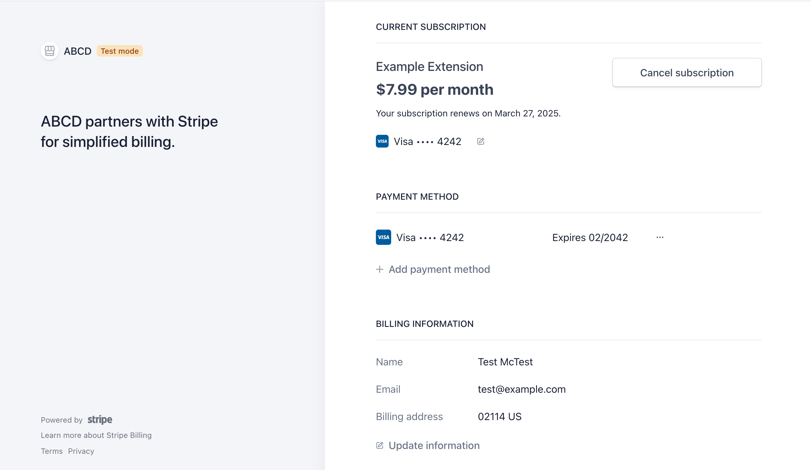
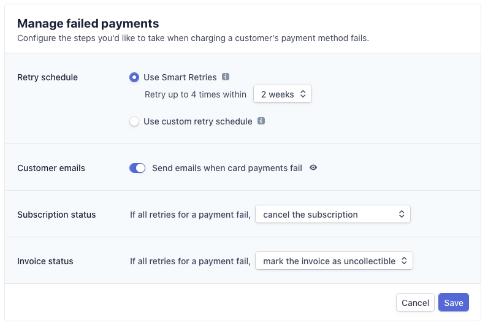
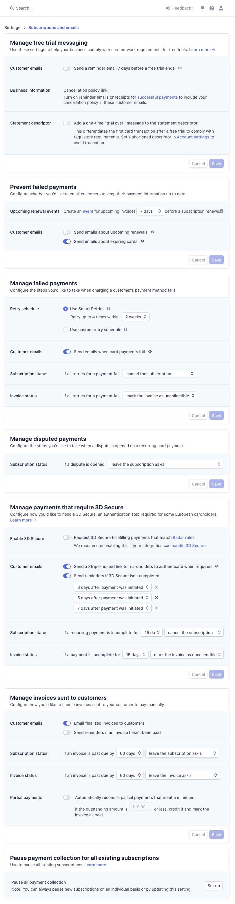

How Subscriptions Work in ExtensionPay
======================================

This document explains how browser extension subscriptions work on [ExtensionPay](https://extensionpay.com).

  * [Setup](#setup)
  * [Subscription Lifecycle](#subscription-lifecycle)
    + [Payment Failures](#payment-failures)
    + [When a user cancels](#when-a-user-cancels)
    + [Example code that handles all subscription states](#example-code-that-handles-all-subscription-states)
  * [Recommended Stripe Billing Settings](#recommended-stripe-billing-settings)

## Setup

To charge subscription payments for your extension, [register your extension](https://extensionpay.com/home/register-extension) and choose the subscription payment option.

When users successfully pay for your extension they will see a screen that looks like this:



You can open this screen programmatically by running `extpay.openPaymentPage()` after the user has paid. You should allow the user to open this page from within your extension.

## Subscription Lifecycle

When a user successfully pays for a subscription, their `subscriptionStatus` from [`extpay.getUser()`](../#4-use-extpaygetuser-to-check-a-users-paid-status) is set to **`active`** and `user.paid` is `true`.

At the end of their billing period (for example, 1 month later), their card will be automatically charged again. If the payment succeeds their `user.subscriptionStatus` will remain `active`.


### Payment Failures

If an automatic subscription payment fails (due to an expired card, insufficient funds, cosmic rays, etc), `user.subscriptionStatus` is set to **`past_due`** and `user.paid` is `false`.

In your [Stripe billing settings](https://dashboard.stripe.com/settings/billing/automatic) you can define what happens after that. By default, Stripe will automatically attempt to charge the user's card a few more times before setting their `subscriptionStatus` to `canceled`.

Ideally, the customer would be notified in your extension and/or emailed by Stripe ("Send emails when card payments fail" option in the screenshot below) to update their card information when a payment fails.

Below is a screenshot of recommended Stripe settings for failed payments:

<center></center>


### When a user cancels

When a user cancels their subscription, it isn't canceled right away. Instead, `user.subscriptionStatus` remains `active` (and `user.paid` is `true`) through the end of the billing cycle.

However, **`user.subscriptionCancelAt`** is populated with the datetime their subscription will expire.

At the end of their billing cycle, `user.subscriptionStatus` will automatically switch to **`canceled`** and `user.paid` will be `false`. `user.subscriptionCancelAt` won't change.

Users who have canceled subscriptions cannot restart their subscriptions. They will have to create a new subscription by paying again.


### Example code that handles all subscription states

Below is example code that handles all the states a user's subscription can enter.

```js
const extpay = ExtPay('my-extension-id');

extpay.getUser().then(user => {

    if (user.paid) {
        console.log("You're paid!")
    } else if (user.subscriptionStatus === 'past_due') {
        console.log("You need to update your card!");
        extpay.openPaymentPage();
    } else if (user.subscriptionCancelAt && user.subscriptionCancelAt < new Date()) {
        console.log("Your subscription will cancel soon.")
    } else if (user.subscriptionStatus === 'canceled') {
        console.log("We hope you enjoyed your subscription!")
    } else {
        console.log("You haven't paid yet :( ")
    }

})
```


## Recommended Stripe Billing Settings

Below is a screenshot of all the recommended Stripe settings for subscription payments in ExtensionPay. You should tweak these settings only after you sign up for ExtensionPay and connect a Stripe account. (You can click the image below to view a larger, more readable version.)

<center><a href="recommended_stripe_billing_settings.png"></a></center>
